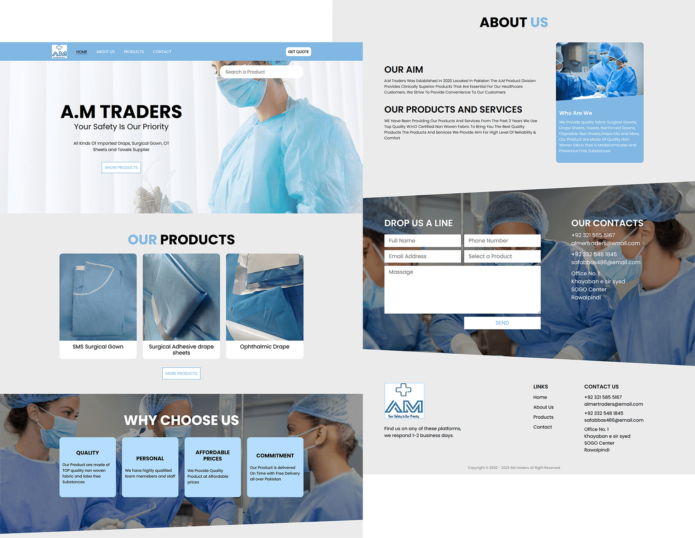

# A.M Traders

This web site is developed with Gulp and has 4 pages. There is a product search and a filter. The mobile first responsive design implemented according to the BEM methodology.

Development files on the branch [dev](https://github.com/Kulyk-Volodymyr/A.M_Traders/tree/dev)

Live site - [GitHub](https://kulyk-volodymyr.github.io/A.M_Traders/)

